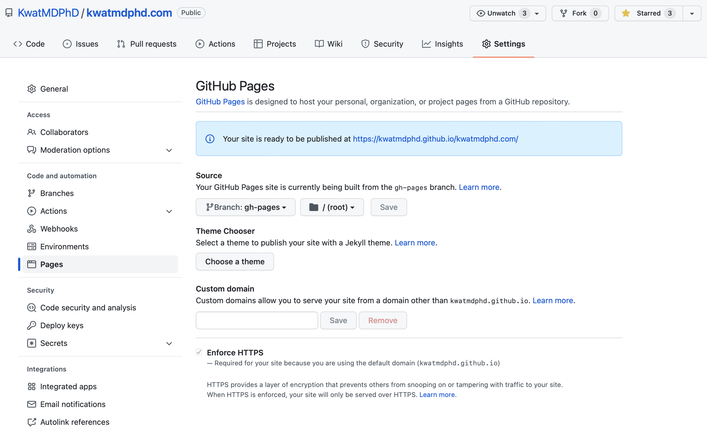
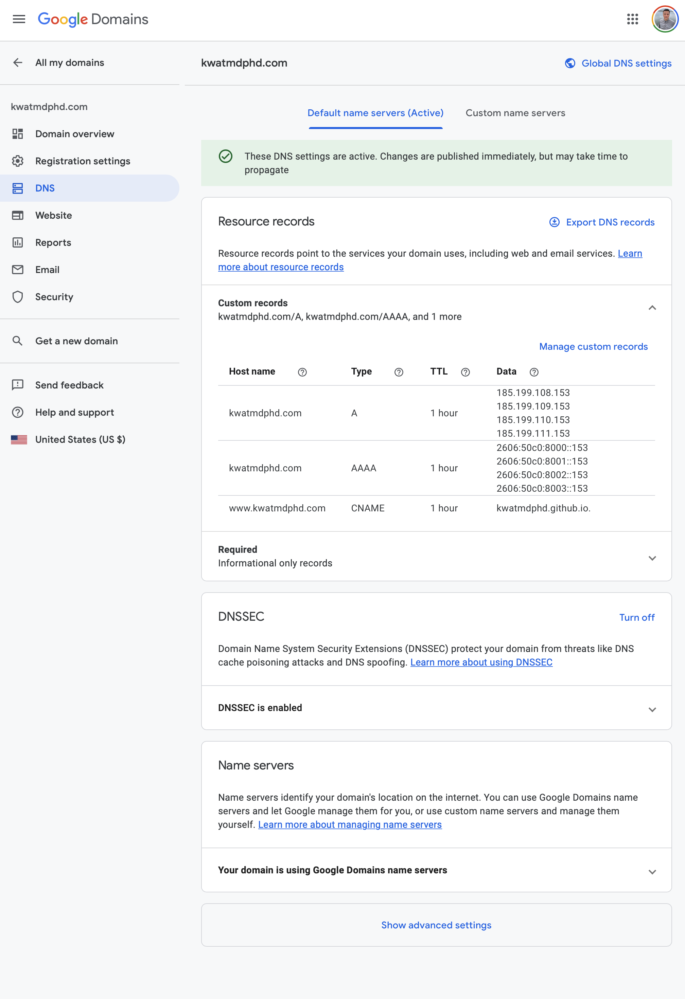

# svelte_static_website_tutorial

Svelte-static-website tutorial for busy perfectionists who want to learn everything :school_satchel:

## Make the simplest svelte app

Make the most minimal app (select `Skeleton project` and no to everything else)

```bash
npm init svelte@next
```

Install dependencies

```bash
npm install
```

Run the app

```bash
npm run dev -- --open
```

## Take a look at the app

Build the app

```bash
ls -l .svelte-kit
```

```bash
npm run build
```

```bash
ls -l .svelte-kit
```

Preview the build

```bash
npm run preview -- --open
```

## Publish the app to GitHub Pages

Read https://kit.svelte.dev/docs#adapters-supported-environments-static-sites and follow:

Install `adapter-static` (for only during development)

```bash
npm install --save-dev @sveltejs/adapter-static@next
```

Edit `svelte.config.js`

```diff
-import adapter from '@sveltejs/adapter-auto';
+import adapter from '@sveltejs/adapter-static';
```

Build

```bash
ls -l .
```

```bash
npm run build
```

```bash
ls -l .
```

Use `gh-pages` to deploy the app to `gh-pages` branch:

```bash
npm install --save-dev gh-pages
```

```bash
npx gh-pages --dist build
```

`gh-pages` updates the repository


Set `Pages`



Look at the deployment with private browsing (incognito), which does not cache.

## Grow the app

Edit `src/routes/index.svelte`.

Remove old build

```bash
rm -fr build
```

Build

```bash
npm run build
```

Deploy

```bash
npx gh-pages --dist build #--dotfiles
```

If the update does not show up, clear cache or use private browsing (incognito), which does not cache.

Remember this rebuild-deploy sequence as `scripts.deploy` in `package.json`

```json
    "build": "svelte-kit build",
    "deploy": "rm -rf build && npm run build && npx gh-pages --dist build",
```

Edit more.

Run the sequence

```bash
npm run deploy
```

Repeat.

## Set custom domain

Read https://docs.github.com/en/pages/configuring-a-custom-domain-for-your-github-pages-site.

Update DNS



Check `Pages`


---

## TODO

Carry `.nojekyll` so tha GitHub nojekyll does not mess with this app

```bash
touch static/.nojekyll
```

## Invest in svelte

Do all of https://svelte.dev/tutorial/basics.

Read all of https://kit.svelte.dev/docs.
